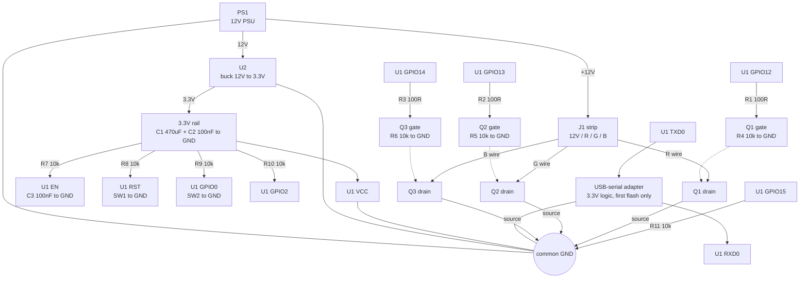

# Hardware

A single-colour-per-channel **12V RGB LED strip** (common anode, the 4-pin `12V R G B` kind, not addressable)
switched by three low-side MOSFETs driven from a **Tuya TYWE3L** module (ESP8266EX, 2 MB flash).

The same circuit works with any 12V or 24V analog strip; only the MOSFET and the strip supply change.

## Bill of materials

| # | Qty | Part | Notes |
|---|-----|------|-------|
| U1 | 1 | Tuya TYWE3L module | ESP8266EX + 2 MB flash. Salvaged from Tuya RGB controllers. A TYWE3S or any ESP-12F works with the same pins |
| U2 | 1 | Buck converter 12V → 3.3V, ≥500 mA | e.g. MP1584EN or LM2596 module. **Not** a linear AMS1117/LM1117: it burns ~3 W from 12V and shuts down |
| Q1-Q3 | 3 | Logic-level N-channel MOSFET | IRLZ34N (used here), IRLZ44N or IRLB8721. See [MOSFET choice](#mosfet-choice) |
| R1-R3 | 3 | 100 Ω resistor | Gate series resistors, limit switching current spikes |
| R4-R6 | 3 | 10 kΩ resistor | Gate pull-downs; without them the LEDs light up while the ESP boots or is off |
| R7-R10 | 4 | 10 kΩ resistor | Pull-ups for EN, RST, GPIO0, GPIO2 |
| R11 | 1 | 10 kΩ resistor | Pull-down for GPIO15 |
| C1 | 1 | 470 µF / 16V electrolytic | Across the module's 3.3V and GND, **as close to the module as possible**. The radio draws 300-400 mA spikes; without this the module resets or crashes |
| C2 | 1 | 100 nF ceramic | Across 3.3V and GND, next to C1 |
| C3 | 1 | 100 nF ceramic | EN to GND, for a clean power-up |
| C4 | 1 | 1000 µF / 25V electrolytic | Optional, across the 12V strip rail if the strip is long |
| SW1 | 1 | Momentary push button | RESET. Optional but handy |
| SW2 | 1 | Momentary push button | FLASH (GPIO0). Needed to flash over serial |
| PS1 | 1 | 12V PSU | Sized for the strip: 12V 2A drives roughly 5 m of 14.4 W/m strip |
| J1 | 1 | 4-pin screw terminal or JST | Strip connection: 12V, R, G, B |
| - | 1 | USB-to-serial adapter, **3.3V logic** | For the first flash only. CH340 or CP2102 with a 3.3V jumper; a 5V-only adapter needs a level shifter on the module's RXD0 |

Strip and enclosure aside, this is a few euros of parts.

## Schematic



Per channel, e.g. red:

```
  GPIO12 ──[R1 100R]──┬── gate Q1
                      │
                  [R4 10k]
                      │
                     GND

  +12V ─── strip red segment ─── drain Q1 ─── source Q1 ─── GND
```


### Connection table

| TYWE3L pin | Connects to |
|---|---|
| VCC | 3.3V from U2, with C1 + C2 to GND at the module |
| GND | Common ground |
| EN | 10 kΩ to 3.3V, 100 nF to GND |
| RST | 10 kΩ to 3.3V, SW1 to GND |
| GPIO0 | 10 kΩ to 3.3V, SW2 to GND (hold low at power-up for flash mode) |
| GPIO2 | 10 kΩ to 3.3V (must be high at boot) |
| GPIO15 | 10 kΩ to GND (must be low at boot) |
| GPIO12 | 100 Ω to Q1 gate (red) |
| GPIO13 | 100 Ω to Q2 gate (green) |
| GPIO14 | 100 Ω to Q3 gate (blue) |
| TXD0 | USB-serial RXD (first flash only) |
| RXD0 | USB-serial TXD (first flash only) |

| MOSFET (each) | Connects to |
|---|---|
| Gate | 100 Ω from its GPIO, plus 10 kΩ to GND |
| Drain | The strip's colour wire (R, G or B) |
| Source | Common ground |

The strip's 12V wire goes straight to the PSU: the MOSFETs switch the negative side of each colour.

## Notes that matter

**Power.** Most failures during this build were supply problems, not firmware. The ESP8266 draws 300-400 mA
spikes when the radio transmits; a sagging 3.3V rail produces random resets and "illegal instruction" crashes,
often during Wi-Fi connect or radio calibration. Fit C1 close to the module, keep the 3.3V wires short, and use
a switching converter rated well above the average draw. The firmware transmits at 12 dBm
(`WIFI_TX_POWER_DBM` in `firmware/src/config.h`) to keep those spikes small.

**Common ground.** The 12V supply, the 3.3V converter, the module, the MOSFET sources and the USB-serial
adapter must share one ground. A missing ground between the adapter and the module is a silent serial link.

**Never power the module from USB and the converter at the same time** while flashing: the two supplies fight,
and USB hosts can brown out. Use one at a time, and connect only GND, TX and RX to the adapter.

<a name="mosfet-choice"></a>**MOSFET choice.** The gates are driven at 3.3V, below what many "logic level"
parts specify. The IRLZ34N used here is characterised at 4V and works, but with higher on-resistance, so keep
it under ~3 A per channel and check it doesn't get hot at full white. For more current, use a MOSFET rated at
2.5V gate drive or add a gate driver. For small loads an SMD AO3400 is plenty.

**Strip type.** This is for analog strips where each colour is one long parallel circuit. Addressable strips
(WS2812, SK6812) need a different driver and firmware; use [WLED](https://kno.wled.ge/) for those.

## First flash

1. Disconnect the 12V supply, power the module from the USB-serial adapter's 3.3V or a bench supply.
2. Hold SW2 (GPIO0), tap SW1 (RESET), release SW2. The module is now in flash mode.
3. `cd firmware && pio run -e tywe3l -t upload`
4. Remove the GPIO0 short and reset. See the [README](README.md) for Wi-Fi setup.

Later updates go over Wi-Fi, so the serial wires can be removed after the first flash.
